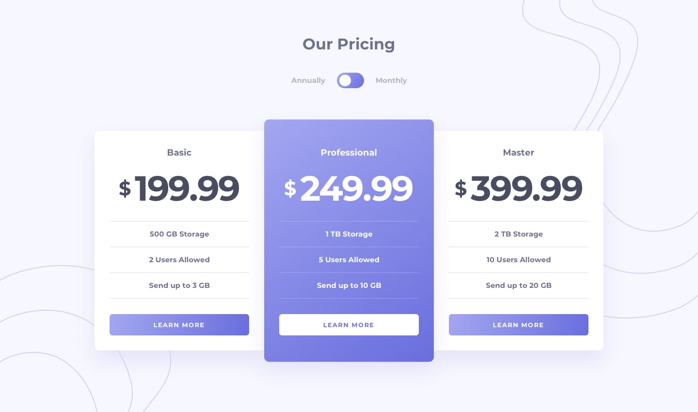
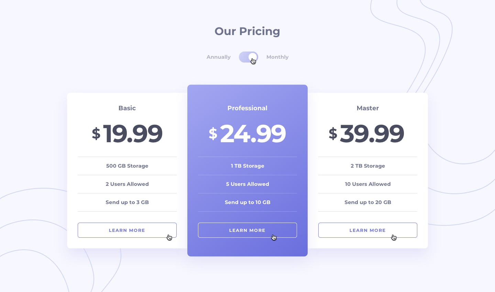
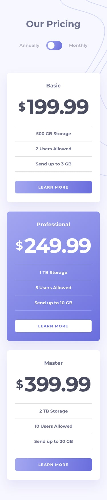

# Frontend Mentor - Pricing Component With Toggle Solution

This is my solution to the **Pricing Component With Toggle** challenge on Frontend Mentor. This project focuses on building a fully responsive and interactive pricing component using semantic HTML, modern CSS, and vanilla JavaScript.

The challenge was a great opportunity to practice responsive layouts, custom toggle components, DOM manipulation, accessibility improvements, and scalable frontend architecture without using frameworks or external libraries.

---

## Table of contents
- [Overview](#overview)
- [The challenge](#the-challenge)
- [Design](#design)
- [Links](#links)
- [My process](#my-process)
- [Built with](#built-with)
- [What I learned](#what-i-learned)

---

## Overview
This project is a responsive pricing component that allows users to switch between annual and monthly pricing plans through a custom toggle switch.

The application dynamically updates pricing values based on the selected billing option while maintaining a clean and accessible user experience.

The interface is fully responsive and adapts smoothly across desktop, tablet, and mobile devices.

All styling was built using modern CSS techniques such as Flexbox, CSS custom properties, gradients, and media queries, while the interactivity was implemented using vanilla JavaScript with DOM manipulation and event-driven programming.

---

## The challenge
Users should be able to:

- View the optimal layout depending on their device’s screen size.
- Toggle between annual and monthly pricing plans.
- See pricing values update dynamically.
- Experience hover and focus states for interactive elements.
- Navigate the interface using keyboard interactions.
- View a responsive and accessible pricing layout across devices.
- Interact with a fully custom toggle switch component.

---

## Design

- Desktop Design Anually

- Desktop Design Monthly

- Active States  

- Mobile Design Anually

- Mobile Design Monthly

---

## Links
- Solution URL: [GitHub Repository](https://github.com/mlopezl/pricing-componet-with-toogle)
- Live Site URL: [Live Demo](https://mlopezl.github.io/pricing-componet-with-toogle/)

---

## My process
- Structured the layout using **semantic HTML5** elements such as `header`, `main`, and `article`.
- Followed a **mobile-first approach**, progressively enhancing the layout with media queries.
- Built responsive layouts using **Flexbox** for alignment and spacing.
- Used **CSS custom properties (variables)** to create a reusable and scalable design system.
- Applied a component-based structure for cards, buttons, pricing sections, and toggle elements.
- Used gradients, shadows, and modern spacing techniques to improve visual hierarchy.
- Created a fully custom toggle switch using HTML and CSS.
- Implemented dynamic pricing updates through **DOM manipulation**.
- Added interactivity using JavaScript event listeners:
  - `change`
  - `click`
  - `keydown`
  - `focusin`
- Improved accessibility by supporting keyboard navigation and focus interactions.
- Used **event delegation** to manage card focus states efficiently.
- Managed UI states through dynamic class manipulation using `classList`.
- Maintained separation of concerns between structure (HTML), styling (CSS), and behavior (JavaScript).

---

## Built with
- HTML5
- CSS3
- JavaScript (ES6)
- Flexbox
- CSS custom properties (variables)
- Mobile-first workflow
- Responsive design principles
- BEM-inspired naming convention
- DOM manipulation
- Event listeners
- Event delegation
- Keyboard accessibility
- CSS gradients
- CSS transitions
- Media queries

---

## What I learned
- Structuring responsive layouts using **semantic HTML5**.
- Building modern responsive interfaces with **Flexbox**.
- Organizing scalable CSS using reusable naming conventions.
- Creating reusable design systems with **CSS variables**.
- Building fully custom UI components such as toggle switches.
- Dynamically updating interface content through **DOM manipulation**.
- Managing UI state using JavaScript and CSS classes.
- Improving accessibility with keyboard interactions and focus management.
- Using **event delegation** to simplify event handling logic.
- Creating responsive layouts using a **mobile-first workflow**.
- Improving user experience with hover effects, transitions, gradients, and visual feedback.
- Writing clean, modular, and maintainable frontend code without frameworks.